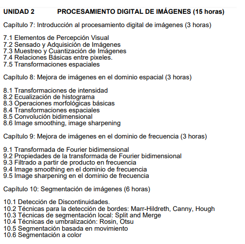

# SEGUNDA PARTE

## Para la segunda parte del curso

## Aún se esta viendo la extracción de video de cada curso

### Nota importante: En PSID se trabaja con MATLAB, en el curso de edX se trabaja en Visual Studio 2013 C++. * Tener muy en cuenta esto ultimo

> https://courses.edx.org/courses/course-v1:UC3Mx+ISA.1x+3T2017/course/

>> Para la segunda parte del curso debes tener la terminología clara. (Ejemplo: Filtro, Kernels, metos avanzados de filtrado).

### Programa analítico del curso

> * #### Segunda parte del curso
>> 