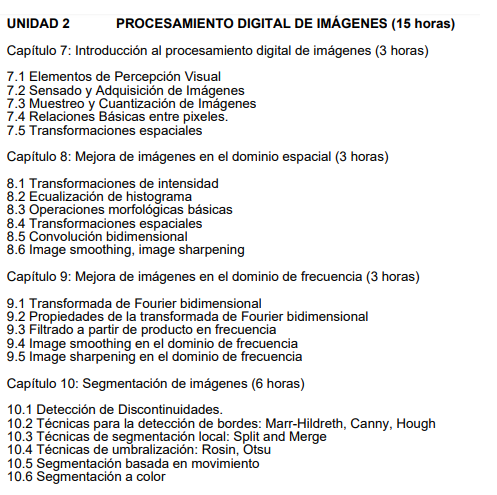

# CURSOS CONCEPTUALES

## Cursos que debes saber conceptualmente para ir preparado

> Para la primera parte del curso debes tener noción de sumatorias para sistemas discretos y integrales para sistemas continuos. (En PSID solo se ve la parte discreta).

> Para la segunda parte del curso debes tener la terminología clara. (Ejemplo: Filtro, Kernels, metos avanzados de filtrado).

### Programa analítico del curso

> * #### Segunda parte del curso
>> 