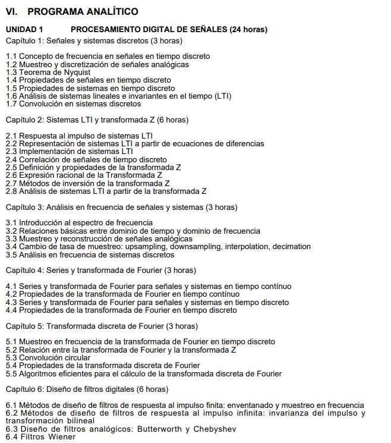

# Procesamiento de Señales e Imágenes Digitales

## Esta es una guía personal para PSID.
## El curso pesa cerca de 1 Gb.
## Descargar todo: https://github.com/ZurMaD/PUCP/archive/master.zip

### El curso fue dictado en el semestre 2018.1 por Renán Rojas.

> 

>> 

>> Se debe seguir según la enumeración

> Este repositorio está completamente restringido a la comunidad PUCP y el enlace a este repositorio está únicamente manipulado por la comunidad PUCP

# #NoBan :( 

### Programa analítico del curso

> * #### Primera parte del curso 
>> 

> * #### Segunda parte del curso
>> 
